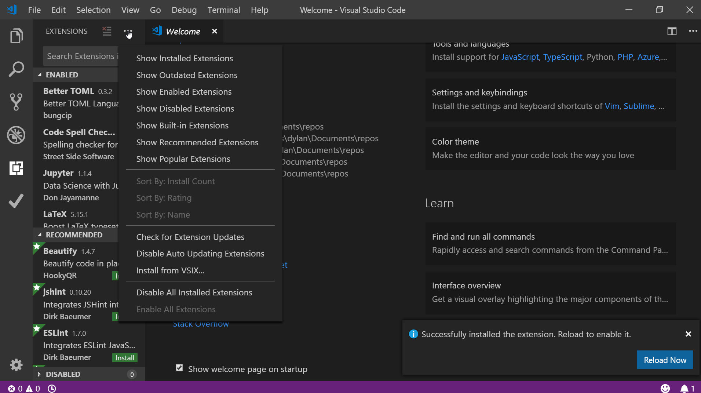

# Getting Started with VSCode and WPILib

## Install Git

[Git install guide](https://git-scm.com/book/en/v2/Getting-Started-Installing-Git)

## Install Visual Studio Code

[VSCode setup page](https://code.visualstudio.com/docs/setup/setup-overview)

## Install VS Code extension

[Releases](https://github.com/wpilibsuite/vscode-wpilib/releases)

install [alpha 4](https://github.com/wpilibsuite/vscode-wpilib/releases/tag/v2019.0.0-alpha-4)

Download the vsix file

From extensions click the "More Actions" dots, select "install from VSIX"

## Use Extension to Start a Project

If you're reading this, it's too late.